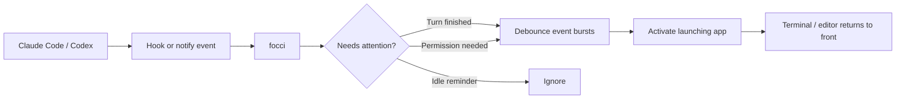

# focci

Bring your coding agent back when it needs you, not every time it makes noise.

`focci` is a small macOS helper for people who run long tasks in
[Claude Code](https://claude.com/claude-code) or
[Codex](https://developers.openai.com/codex). It listens to the agent's hook or
notify events and activates the terminal or editor that launched the session
when there is something useful for you to do: review a completed turn, approve a
permission request, or continue the conversation.

The important part is the filtering. AI coding agents can emit repeated idle
messages after they have already told you they are waiting. `focci` ignores
those reminders, so your focus is not repeatedly pulled away from whatever you
are doing next.

> macOS only. Focus-stealing is inherently OS-specific; focci uses the
> macOS app-activation APIs (`open -b` / AppleScript).

## The workflow it fixes

| Without focci | With focci |
|---------------|------------|
| Start an agent task, then keep checking the terminal. | Start an agent task and move on. |
| Notice late that the agent finished or is blocked on approval. | The launching terminal/editor comes forward when the turn completes or needs permission. |
| Get pulled back by repeated idle reminders even after you already responded. | Idle reminders are ignored, so only useful events get focus. |
| Remember which terminal, editor, or IDE was running the agent. | focci detects the launching macOS app and focuses that app. |

## How it works



In practice, `focci` stays out of the agent's decision-making path. The hook
commands are observational, exit successfully, and do not tell the agent what to
do. They only decide whether the current event should bring your app forward.

A typical session looks like this:

1. Start a longer Claude Code or Codex task.
2. Switch to another app while the agent works.
3. If the agent finishes a turn or needs approval, focci brings the launching
   terminal/editor forward.
4. If the agent only repeats that it is waiting for input, focci ignores it.

## What triggers a refocus

| Agent       | Event                                             | Refocus? |
|-------------|---------------------------------------------------|----------|
| Claude Code | `Stop` (turn finished)                            | ✅ yes   |
| Claude Code | `Notification` — "Claude needs your permission…"  | ✅ yes   |
| Claude Code | `Notification` — "Claude is waiting for your input" (idle reminder) | ❌ ignored |
| Codex       | `notify` — `agent-turn-complete`                  | ✅ yes   |

A short **debounce** (default 1500 ms, per target app) collapses bursts — e.g. a
`Stop` plus a permission `Notification` from the same turn — into a single
refocus.

## Install

### Homebrew (recommended)

```sh
brew install HabibUllahKhanBarakzai/focci/focci
```

focci is distributed as a Homebrew cask (a prebuilt, unsigned binary). On
Homebrew 4.5+ you may be asked to trust the tap once before installing:

```sh
brew trust --cask HabibUllahKhanBarakzai/focci/focci
```

That installs the `focci` binary. Then wire it into your agents:

```sh
focci install            # configures Claude Code (and Codex if present)
```

### From source

```sh
git clone https://github.com/HabibUllahKhanBarakzai/focci
cd focci
go install .          # installs focci to $(go env GOPATH)/bin
focci install
```

Or build a local binary without installing:

```sh
go build -o focci .
./focci doctor
```

## Usage

```
focci install [--agent claude|codex|all] [--command <path>] [--force]
focci uninstall [--agent claude|codex|all]
focci doctor          # show detected app + integration status
focci focus [--force] # refocus right now (handy for testing)
```

- **`install`** adds the hooks to `~/.claude/settings.json` and, for Codex, sets
  `notify` in `~/.codex/config.toml`. It is idempotent, backs up each file to
  `*.bak` before writing, and never overwrites an unrelated Codex `notify`
  unless you pass `--force`.
- **`doctor`** prints which app it would focus and whether the hooks are wired —
  run it first if something isn't working.

### What `install` writes

`~/.claude/settings.json`:

```json
{
  "hooks": {
    "Stop": [
      { "hooks": [ { "type": "command", "command": "/opt/homebrew/bin/focci claude --event stop" } ] }
    ],
    "Notification": [
      { "matcher": "", "hooks": [ { "type": "command", "command": "/opt/homebrew/bin/focci claude --event notification" } ] }
    ]
  }
}
```

`~/.codex/config.toml`:

```toml
notify = ["/opt/homebrew/bin/focci", "codex"]
```

You can also wire it up by hand if you prefer not to let the tool edit your
config.

## How it finds the right window

The agent runs the hook as a child process, so it inherits the GUI app's
`__CFBundleIdentifier` — the bundle id of whatever launched the session
(PyCharm, Warp, iTerm, Terminal, VS Code, …). focci reads that and
activates the app. If it's missing, it falls back to a `TERM_PROGRAM` mapping.

## Configuration (environment variables)

| Variable             | Default  | Purpose                                                        |
|----------------------|----------|----------------------------------------------------------------|
| `FOCCI_BUNDLE_ID`    | —        | Force a specific app bundle id (overrides detection).          |
| `FOCCI_DEBOUNCE_MS`  | `1500`   | Debounce window in milliseconds (per target app).              |
| `FOCCI_DEBUG`        | off      | Set to `1` to log decisions/outcomes to stderr.                |

## Troubleshooting

```sh
focci doctor
# Then simulate an event with debug output:
echo '{"hook_event_name":"Stop"}' | FOCCI_DEBUG=1 focci claude --event stop
```

- **"No host app detected"** — your shell didn't pass `__CFBundleIdentifier` and
  `TERM_PROGRAM` isn't recognized. Set `FOCCI_BUNDLE_ID` (find it with
  `osascript -e 'id of app "iTerm"'`).
- **Focuses too often / not enough** — tune `FOCCI_DEBOUNCE_MS`.

## Design notes

focci is purely **observational**: the hook entry points always exit `0`
and never emit a `decision`, so they can't block or fail an agent's turn.

Layout:

```
main.go                      entry point (delegates to cmd)
cmd/                         Cobra commands (claude, codex, focus, install, uninstall, doctor)
internal/event/              the refocus/ignore decision logic
internal/focus/              bundle resolution, activation, per-app debounce
internal/config/             idempotent wiring of settings.json (Claude) and config.toml (Codex)
```

## License

[Apache-2.0](LICENSE).
